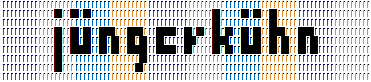
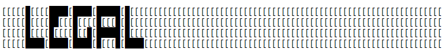

# net_work

tutorial coming soon....

Generator itself is licensed under LGPL 3.0 https://choosealicense.com/licenses/lgpl-3.0/
The source code can be found here: https://github.com/KonradJuenger/net_work/blob/main/sideTable.py

The actual .gcode files contained in and generated with the application are derivative 
work of our orginal design and they as well as the resulting 3d prints are protected under copyright. 
The following conditions apply:
- You may use the the .gcode files for personal, non-commercial use.
- (Online)-Publication of works based on the application is permitted and attibution to the original authors appreciated.
- Re-distribution is prohibited, please link to preferably http://www.juengerkuehn.com/project/net_work/  or https://github.com/KonradJuenger/net_work/
- For commercial and any non-private (exhibitions,etc) use please contact the original authors via mail@juengerkuehn.com

